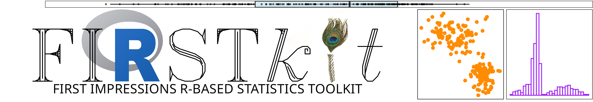

<head>
    <style>
        body {
            position: relative;
            font-family: Arial, sans-serif;
        }
        .watermark {
            position: fixed;
            bottom: 50%;
            right: 10%;
            opacity: 0.1;
            font-size: 5em;
            color: #000;
            z-index: -1;        
            }
    </style>
</head>

## Introduction 

We have all seen the increasing importance of statistical literacy in almost all disciplines. Consequently, there is tremendous need for teaching statistics as a introductory core course. Modern statistics is best learn and done with the aid of computational devices, so an essential part of any statistics course is the use of statistical software. One of the most popular statistical software is [**R**](https://www.r-project.org/). However, **R** is challenging specially for those individuals who do not have experience or just do not have the time or need to learn a programming language. [**FIRSTkit**](https://github.com/ialmodovar/FIRSTkit) was created with this in mind. Under the hood, **FIRSTkit** is a Shiny App that is created to be a free companion to the teaching of introductory courses without  any previous programming knowledge. An added benefit is that students and users in the applied disciplines can use the software later as needed. FIRSTkit is licensed under the [GNU General Public License v3.0](https://www.gnu.org/licenses/gpl-3.0.txt).

<div class="watermark"></div>

## Modules

### **Descriptive statistics**

  + Location summaries 
    + Sample Mean 
    + Sample Median 
    + Sample Geometric Mean
    + Sample Trimmed mean
  + Dispersion summaries 
    + Sample Standard Deviation
    + Sample Variance 
    + Sample Interquartile Range
    + Median Absolute Deviation
    + Sample Range
  + Univariate Data Visualization 
    + Box-plots 
    + Histograms
    + Stem-and-Leaf
    + Scatterplots
    + Bar graphs

### **Probability Theory**

  + Set Theory
  + Bayes Probability Tree
  + Probability Distributions Functions
    + Binomial Distribution
    + Poisson Distribution
    + Hypergeometric Distribution
    + Chi-Squared Distribution
    + Normal Distribution
    + Student's $t$-distribution
    + Snedecor's $F$-distribution

### **Statistical Inference**

  + One-Sample Inference 
    + One-Sample $t$-test for a population mean
    + Wilcoxon signed-rank test a location parameter
    + One-Sample $\chi^2$ Test for the Population Variance 
    + One-Sample proportion test
  + Two-Sample Inference
    + Two-Sample $t$-test to compare two population means (dependent and independent samples)
    + Wilcoxon-Mann-Whitney test to compare two location parameters 
    + Two-Sample $F$-test to compare two population variances
    + Ansari-Bradley test for comparing two scale parameters
    + Two-Sample proportion test
  + Three-Sample or more Inference
    + One-Way Analysis of Variance (ANOVA)
    + Kruskal-Wallis Rank sum test
    + Bartlett Test for Homogeneity of Variances
    + Fligner-Killeen Test of Homogeneity of Variances

### **Linear Regression**

  + Pearson correlation 
  + Linear regression
    + Simple and Multiple regression
    + Model summary
  + ANOVA Table for the linear regression model
  + Model Diagnostics
    + Residuals and Studentized residuals
    + Quantile-Quantile plot
  + Cook's Distances

## Accessing

You can access **FIRSTkit** on the shinyapps.io, [https://ialmodovar.shinyapps.io/FIRSTkit/](https://ialmodovar.shinyapps.io/FIRSTkit/)

## Installation as a R package

**FIRSTkit** is designed to be run from the browser and hosted on an institutional Shiny server so that students and users do not have any need form of installation. 

However, the software can also be installed as an R package. You can install it directly from GitHub via the *devtools* package:

```R
library("devtools")
install_github("ialmodovar/FIRSTkit")
```

Once install the package, you can open *FIRSTkit*

```R
FIRSTkit::FIRSTkit()

## you can also try
library("FIRSTkit")
FIRSTkit()
```

## Authors:
Israel Almodóvar-Rivera and Ranjan Maitra

If you have any questions or comment we prefer that you open an [issue](https://github.com/ialmodovar/FIRSTkit/issues). You can also send and email to *israel.almodovar@upr.edu* or *maitra@iastate.edu*.

